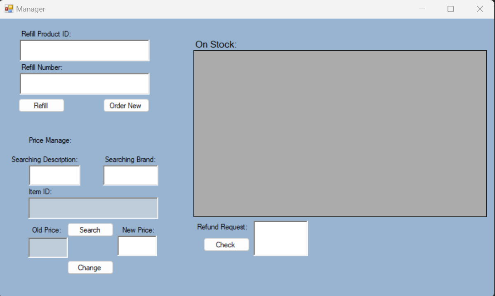
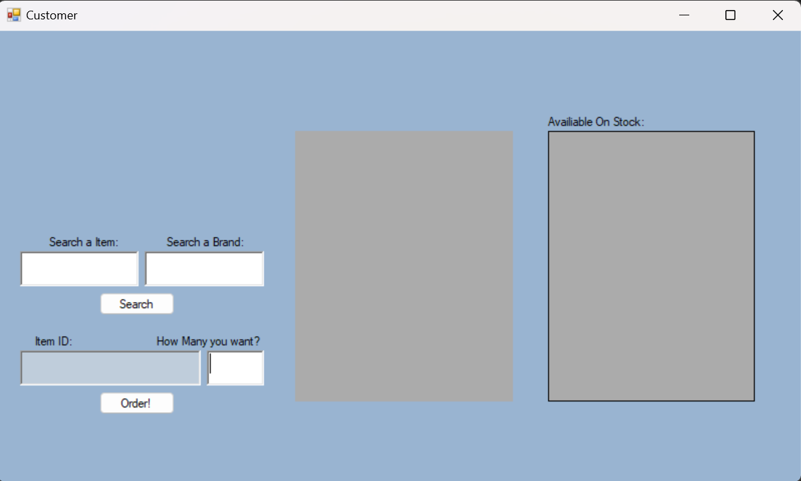

# Inventory Management System

This project is a **C# Windows Forms Application** designed for managing inventory operations with distinct roles for **Manager**, **Seller**, and **Customer**. It provides functionalities for stock management, order placement, and tracking purchase/sale history.

## Features

### **Manager**
- View and manage stock levels.
- Refill existing products or place new orders.
- Adjust product prices.
- Review and process refund requests.

### **Seller**
- Record sales transactions.
- Submit refund requests on behalf of customers.

### **Customer**
- Search for products by name or brand.
- Place new orders.
- View purchase history.

---

## Screenshots

### **Welcome Page**
The entry point to the system, where users can log in or access the manager dashboard.


### **Manager View**
A dedicated interface for managers to handle inventory management, pricing, and refund processing.


### **Customer View**
An intuitive interface for customers to search for products, check availability, and place orders.


---

## Technologies Used

- **C#**: For building the Windows Forms Application.
- **Windows Forms**: For creating the graphical user interface.
- **.NET Framework**: For application development and management.

---

## How to Run

1. **Clone the Repository**:
   ```bash
   git clone https://github.com/your-username/inventory-management-system.git
